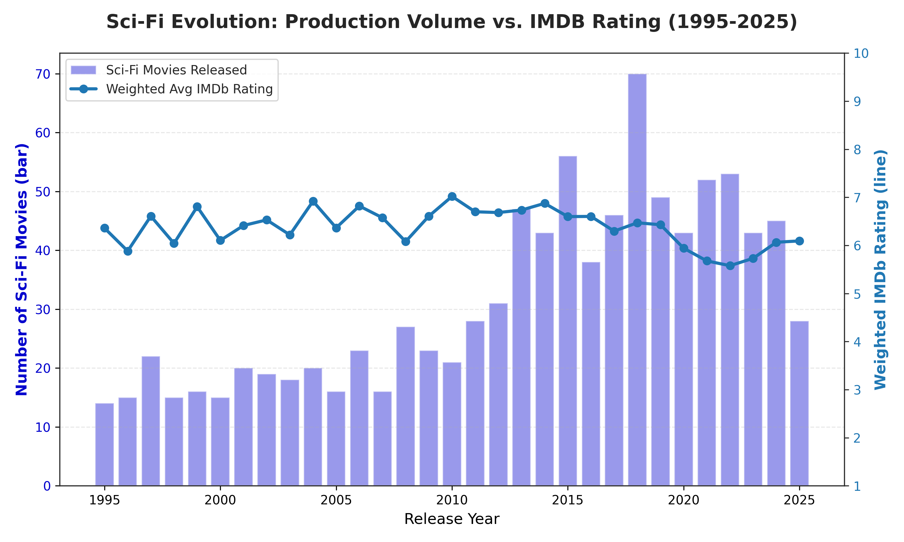
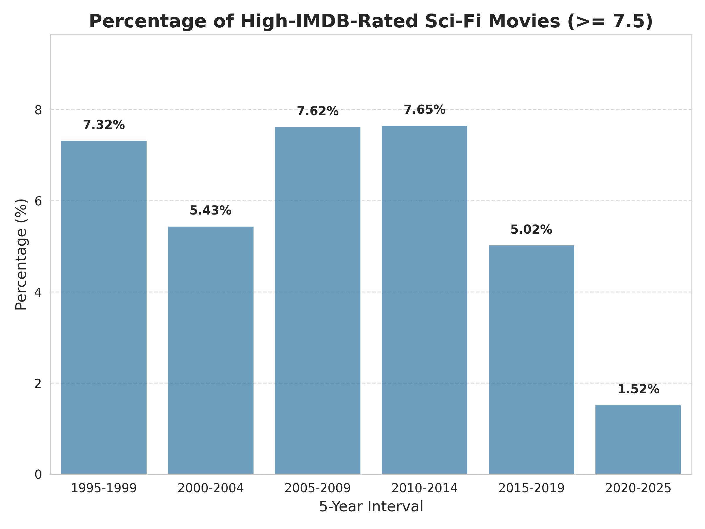
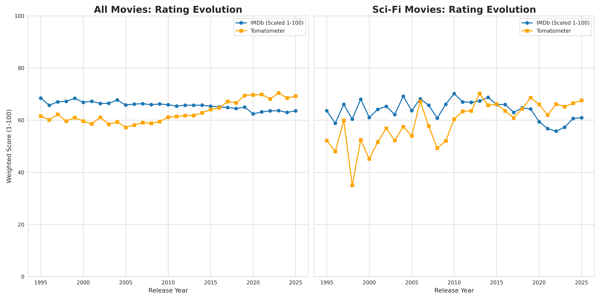

## Executive Summary

Since the mid-90s, the global film industry has pivoted aggressively toward high-volume franchise production, leaning heavily on the Sci-Fi genre. This report investigates a core business question: **Does increased output yield better cinema, or does it trigger a 'Production Trap' that alienates the core audience?**

By analysing a 30-year longitudinal dataset merging massive audience sentiment (IMDb) with professional critical consensus (Rotten Tomatoes), this analysis maps the supply, demand, and quality trends of the Sci-Fi universe. 

**Key Business Insights:**

1. **The Dilution Effect:** While Sci-Fi production skyrocketed after 2010, average quality scores stagnated, proving that increased quantity drove a measurable dilution in average acclaim.

2. **The Post-2019 Crash:** Following a "Golden Era" in the early 2010s, modern Sci-Fi storytelling is experiencing a sharp downward trend, driven by rushed production cycles and shifting audience expectations.

3. **The Polarization Gap:** Sci-Fi exhibits unique market behavior; it is highly "critic-proof," frequently showing massive discrepancies between professional reviews and audience enjoyment.

---

## 1. The Volume vs. Quality Paradox

To understand the health of the Sci-Fi market, we must first look at the relationship between supply (movies released) and demand satisfaction (audience rating). 

The data reveals a stark inflection point post-2010. While studios ramped up production volume—flooding the market with Sci-Fi releases—the IMDB ratings failed to scale proportionally, eventually slipping into a steady decline. This confirms the existence of a "Production Trap." 

  Figure 1: A dual-axis chart showing the rapid growth in Sci-Fi movie release volume vs. the Weighted Average IMDb Rating peaking around the early 2010s before declining.

Furthermore, when breaking the 30-year timeline into 5-year intervals, the percentage of "High-Rated" Sci-Fi films (IMDb >= 7.5) peaked in the 2010-2014 block. We are currently witnessing a historical low in the proportion of critically acclaimed Sci-Fi cinema hitting the market.

  Figure 2: A bar chart displaying the percentage of high-rated Sci-Fi movies grouped into 5-year bins, highlighting the peak in 2010-2014 and the visible drop-off in 2020-2025.

---

## 2. Market Inflation & The Modern Sci-Fi Crash

A critical component of this analysis involved scaling IMDb scores (1-10) to a 100-point system to directly compare "Fan Favor" against "Professional Consensus" (Tomatometer). 

When comparing the general movie market to the Sci-Fi subset, two distinct narratives emerge:

1. **General Market "Critic Inflation":** In the broader industry, a 70% Rotten Tomatoes score has become the new average.

2. **The Sci-Fi Divergence:** During the 2010-2020 decade, fan and critic scores heavily overlapped, largely driven by the **"Marvel Formula"**—a highly successful industrial recipe of top-tier visual effects and safe, accessible storytelling. However, since 2019, Sci-Fi IMDb ratings haven't just diverged from critics; they have dropped below the baseline industry average.

  Figure 3: A side-by-side line graph comparison showing "All Movies" with rising scores vs. "Sci-Fi Movies" highlighting a sharp divergence post-2019 where audience ratings plummet.

### The Drivers of the Decline
The recent crash in Sci-Fi audience reception is likely the result of two colliding market forces:

* **The Supply Side:** Pandemic-induced backlogs, industry strikes, and the relentless demand for streaming content have forced rushed production cycles, resulting in undercooked scripts and unpolished VFX.

* **The Demand Side - The 'Reality Gap':** The explosion of real-world AI technologies (like ChatGPT) has fundamentally shifted consumer baselines. Audiences who use advanced AI daily find traditional "robots taking over" tropes outdated. Reality is outpacing Hollywood, resulting in a harsher grading scale from a more tech-savvy audience.

---

## 3. Representative Genre Gallery: A Market Map

To wrap up this report and bring some visual life to the data, I categorized the most impactful Sci-Fi films into a standard 2x2 market matrix based on their relationship to the genre medians (IMDb: 6.0, RT: 60%). 

To ensure the gallery represents the highest-visibility titles, I filtered for the **Top 6 most voted movies** within each of the four possible metric combinations:

* **High Audience / High Critic:** The industry ideal, where general fan enjoyment aligns perfectly with professional acclaim.
* **Low Audience / High Critic:** The polarized "critic-first" space, where professional reviewers praise the craft, but general audiences score it below average.
* **High Audience / Low Critic:** The polarized "audience-first" space, where fan engagement and enjoyment heavily outpace professional critical reviews.
* **Low Audience / Low Critic:** The bottom quadrant, representing high-visibility titles that ultimately failed to resonate with either demographic.

  Figure 4: A 2x2 market map displaying the top 6 most voted Sci-Fi films for each combination of Audience (IMDb) and Critic (Tomatometer) reception.

---

  <strong>Want to dive deeper?</strong> If you want to explore the Python code, API data pipelines, and raw methodology behind this analysis, please check out the <a href="https://github.com/XinranStat/The-Production-Trap-Hollywood-s-Sci-Fi-Paradox">full technical notebook on my GitHub</a>.

## Appendix: Methodology & Data Architecture

To ensure the insights in this report are robust and scalable, a custom data pipeline was engineered to harvest, clean, and normalize the foundational data. 

### A. Data Ingestion & API Harvesting
The dataset merges two primary sources:

1. **Core Relational Data:** Foundational metadata (IDs, Titles, Release Years, Audience Votes) was extracted from local SQLite databases containing the IMDb movie universe. The non-commercial IMDB dataset is provided on website: <https://datasets.imdbws.com/> (title.basics.tsv.gz, title.ratings.tsv.gz)

2. **Enriched Metadata via API:** I used the OMDb API to fetch extended attributes unavailable in basic IMDb dumps. This included Rotten Tomatoes scores, Box Office data, Awards, and Full Plot Descriptions (crucial for future NLP/thematic analysis). The API is available at: <http://www.omdbapi.com/> (Requires API key, Patreon tier used for this project)

*Note: The pipeline utilized checkpointing to handle API rate limits and connection interruptions smoothly.*

### B. Feature Engineering
Raw metadata was transformed into structured analytical metrics:

* **Rating Normalization:** Semi-structured Rotten Tomatoes strings were parsed and converted into nullable integers. IMDb scores were scaled to a 100-point metric for 1:1 comparative analysis.

### C. Statistical Framework: Square Root Weighting
In movie analytics, raw averages give too much power to obscure films with few votes, while linear weighting allows massive blockbusters (e.g., *Avengers: Endgame*) to completely mask industry-wide trends. 

To solve this, this analysis utilized **Square Root Weighting** (`np.sqrt(numVotes)`). This mathematical "middle ground" ensures that highly popular movies appropriately drive the trend line, while preserving the statistical voice of high-quality, mid-budget films.

**A Simple Numerical Example:**
Imagine a year with only two Sci-Fi releases. We have a small **Viral Indie Hit** (loved by a few) and a heavily marketed **Global Blockbuster** (watched by millions, but considered mediocre):

* **Indie Hit:** Rating = **9.0** | Votes = **10,000**
* **Blockbuster:** Rating = **5.0** | Votes = **1,000,000** 

If we want to calculate the "Average Sci-Fi Rating" for this year, here is how the three methods perform:

1.  **Raw Average (No Weighting):** 
    * *Math:* (9.0 + 5.0) / 2
    * *Result:* **7.0**
    * *The Problem:* The indie film is massively over-represented. It ignores the fact that 100 times more people watched the blockbuster.
2.  **Linear Weighting (Full Votes):** 
    * *Math:* [(9.0 * 10,000) + (5.0 * 1,000,000)] / 1,010,000
    * *Result:* **5.04**
    * *The Problem:* The blockbuster completely bullies the trend line. The critical success of the indie film is virtually erased.
3.  **Square Root Weighting (Our Method):** 
    * *Weights:* √10,000 = **100** | √1,000,000 = **1,000**
    * *Math:* [(9.0 * 100) + (5.0 * 1,000)] / 1,100
    * *Result:* **5.36**
    * *The Solution:* The blockbuster is still the 'main voice' (the score is closer to 5.0 than 9.0), but the indie film's high quality successfully pulls the industry average up, proving it still has a measurable impact on the market.

