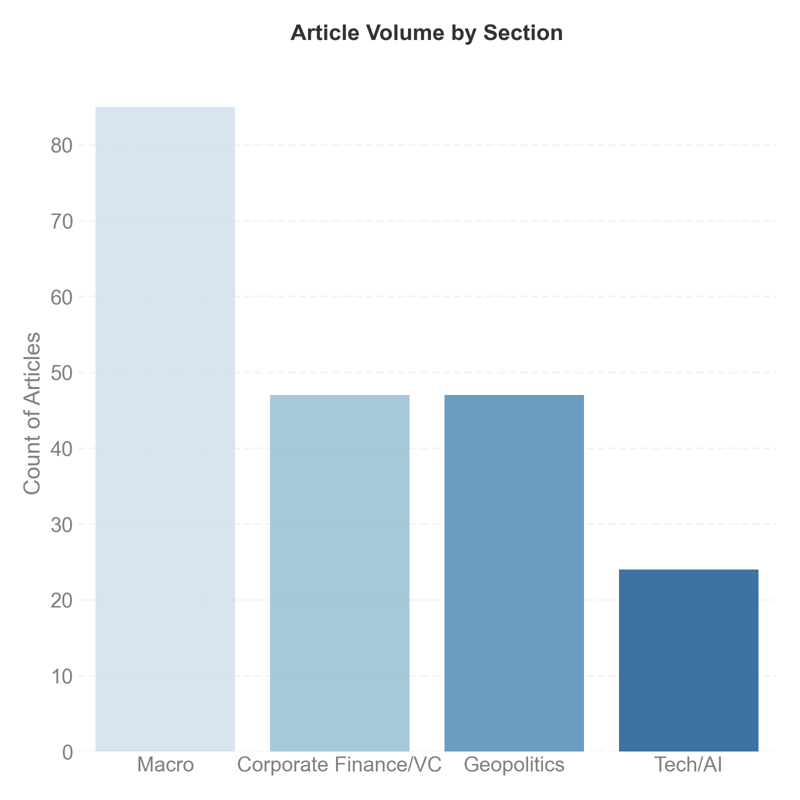
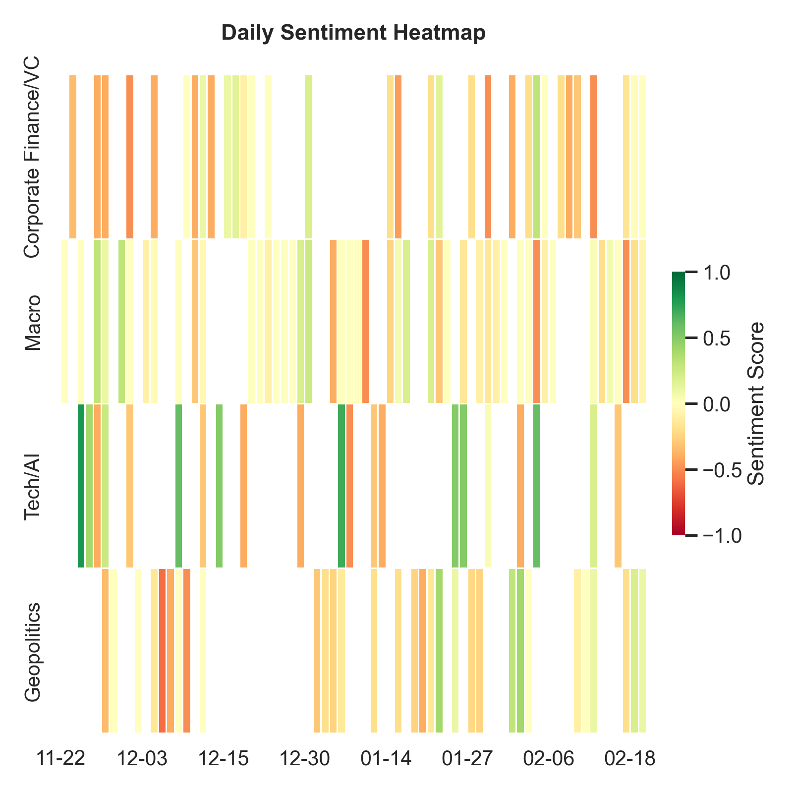



# 48-Hour Market Snapshot



# Key Market Drivers

*High-impact articles identified based on strategic relevance and sentiment magnitude.*



---

# Market Trends & Sentiment Analysis

**Nasdaq 100 vs. 10Y Treasury Yield (Rolling 3 Months)**

*Hover over the red circles to see the specific news events that triggered significant market moves.*

<iframe src="market_plot.html" width="100%" height="500px" style="border:none;"></iframe>

**Section-wise Volume & Sentiment Heatmap (Rolling 90 Days)**

:::: {.columns}

::: {.column width="50%"}

:::

::: {.column width="50%"}

:::

::::

---

# Tech-focused Strategy Matrix

*This matrix categorizes headlines into a strategic decision framework.*



# Sector-wise Deep Dive

*Opportunities, Risks, and Watchlist items derived from The Economist archives.*



---

# Methodology

**Workflow Overview**
This dashboard is generated by an automated Python pipeline (`fin_news_dashboard.py`) that executes the following steps daily:

1.  **Data Ingestion (ETL):** The system scrapes RSS feeds from *The Financial Times* (Markets) and *The Economist* (Business, Finance, US).
2.  **Filtering Logic:**
    * **Time:** Applies a 48-hour window for daily news and a 90-day rolling window for macro trends.
    * **Relevance:** Articles are auto-tagged into 4 categories (Macro, Tech/AI, Geopolitics, Corporate Finance).
3.  **AI Analysis (LLM):**
    * **Engine:** Google Gemini 2.5 Flash.
    * **Scoring:** Sentiment is scored on a continuous scale (-1.0 to +1.0) based on operational and strategic impact.
    * **Summarization:** The model synthesizes "Opportunities" and "Risks" into the strategic matrix.
4.  **Visualization:** Data is aggregated using Pandas and visualized using Plotly (interactive) and Seaborn (static).

**Efficiency:** This automated process reduces analysis time from approximately 8 hours/week to 10 minutes/week.

